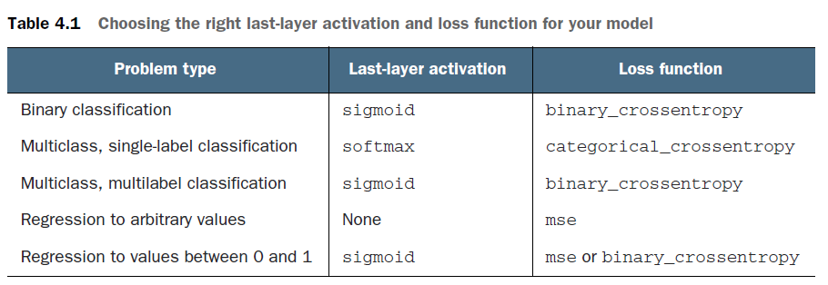

# Deep learning Note

Name: Li-Chi Chang
Professor: Dr. Chen
Date: Feb/19-25
Coverage: Chap 4.4

## ToDo list

1. 2nd video of MIT camp
2. lab on google cloud of MIT camp
3. chap 4.4 - 4.5 & chap 5
4. do some examples

## DL Bible-Ch4

### Ch 4.4 overfitting and underfitting

&nbsp;&nbsp;&nbsp;&nbsp;The processing of fighting overfitting this way is called regularization. We can look to chap 3.4 and find examples. **The simplest way to prevent overfitting is to reduce the size of the model.** the number of learnable parameters in the model (which is determined by the number of layers and the number of units per layer) The general workflow to find an appropriate model size is **to start with relatively few layers and parameters, and increase the size of the layers or add new layers until you see diminishing returns with regard to validation loss.**

### Ch 4.5 The universal workflow of machine learning

1. problem definition
2. evaluation
3. feature engineering
4. fighting overfitting

#### Defining the problem and assembling a dataset

1. What's the input data format?
2. What's the prediction you try to find?
3. What type of problem are you facing?
   1. Binary classification?
   2. Multiclass classification?
   3. Scalar regression?
   4. Vector regression?
   5. Multiclass, multilabel classification?
   6. clustering?
   7. generation?
   8. reinforcement learning?

You have input and assume that:

1. Your outputs can be predicted given your inputs.
2. Your available data is sufficiently informative to learn the relationship between inputs and outputs.

#### Choosing a measure of success

To achieve success, you must define what you mean by success—accuracy? Precision and recall? Customer-retention rate? Your metric for success will guide the choice of a loss function: what your model will optimize.

#### Deciding on an evaluation protocol

* hold-out validation set
* K-fold cross-validation
* iterated K-fold validation

#### Preparing your data

* Data should be formatted as tensors.
* The values taken by these tensors should usually be scaled to small values: for example, in the [-1, 1] range or [0, 1] range.
* Data should be normalized.
* do some feature engineering, especially for small-data problems.

#### Developing a model that does better than a baseline

you need to make three key choices to build your first working model:

* Last-layer activation—This establishes useful constraints on the network’s output.
* Loss function—This should match the type of problem you’re trying to solve.
* Optimization configuration—What optimizer will you use? What will its learning rate be? In most cases, it’s safe to go with rmsprop and its default learning rate.


#### Scaling up: developing a model that overfits

To figure out how big a model you’ll need, you must develop a model that overfits.
This is fairly easy:

1. Add layers.
2. Make the layers bigger.
3. Train for more epochs.

#### Regularizing your model and tuning your hyperparameters

This step will take the most time. Modifing your model.

1. Add dropout.
2. Try different architectures: add or remove layers.
3. Add L1 and/or L2 regularization.
   **I don't know what is it.**
   **(<https://en.wikipedia.org/wiki/Regularization_(mathematics)>)**
4. Try different hyperparameters (such as the number of units per layer or the learning rate of the optimizer) to find the optimal configuration.
5. Optionally, iterate on feature engineering: add new features, or remove features that don’t seem to be informative.

**Need to notice that. Information leak will occur while multiple times iteration.**

If you find a satisfactory model, you can start to train it. If the result of testing set is not as good as the validation set, it means that it is overfitting. Once you meet this issue, you can consider **iterated K fold validation**.

## MINST Example

### The function is below

```python
def mnist2LayersTest(Units,Epochs,Layers):
   from keras.utils import to_categorical
   from keras.datasets import mnist
   from keras import models
   from keras import layers
   import numpy as np

   #(train_images, train_labels), (test_images, test_labels) = mnist.load_data()
   f = np.load("/home/chen/.keras/datasets/mnist.npz")
   train_images, train_labels = f['x_train'], f['y_train']
   test_images, test_labels = f['x_test'], f['y_test']
   f.close()

   #making the neural network>>>
   network = models.Sequential()
   network.add(layers.Dense(Units, activation='relu', input_shape=(28 * 28,)))
   for i in range(Layers):
      network.add(layers.Dense(Units, activation='relu'))
   network.add(layers.Dense(10, activation='softmax'))

   network.compile(optimizer='rmsprop', loss='categorical_crossentropy', metrics=['accuracy'])
   #making the neural network<<<

   #resize the inputs>>>
   train_images = train_images.reshape((60000, 28 * 28))
   train_images = train_images.astype('float32') / 255
   test_images = test_images.reshape((10000, 28 * 28))
   test_images = test_images.astype('float32') / 255
   #add labels
   train_labels = to_categorical(train_labels)
   test_labels = to_categorical(test_labels)
   #resize the inputs<<<

   #training>>>
   network.fit(train_images, train_labels, epochs=Epochs, batch_size=128)
   #training<<<

   #testing>>>
   test_loss, test_acc = network.evaluate(test_images, test_labels)
   #testing<<<

   return test_acc
```

### This is the experiment of the number of Epochs

```python
#epochs find the peak
import matplotlib.pyplot as plt

acclist=[]
for i in range(11):
    acclist.append(mnist2LayersTest(2048,i,0))

plt.plot(acclist)
plt.show()

print(acclist)
```

#### This is the Epochs' result in the array

##### In the loops frmm Epoch experiment

1. 0.053700000047683716
2. 0.9686999917030334
3. 0.9750999808311462
4. 0.979200005531311
5. 0.977400004863739
6. 0.98089998960495
7. 0.9815999865531921
8. 0.9818999767303467
9. 0.9810000061988831
10. 0.9818999767303467
11. 0.9807999730110168

#### Epoch part Summary

In this experiment we can see that, more epochs make more accurancy.

### This is the experiment of the number of Units

```python
#Units find the peak
import matplotlib.pyplot as plt

acclist=[]
for i in range(15):
    acclist.append(mnist2LayersTest(2**i,3,0))

plt.plot(acclist[1:])
plt.show()

print(acclist)
```

#### This is the Units' result in the array

##### In the loops  frmm Unit experiment

1. 0.2240999937057495
2. 0.5679000020027161
3. 0.8130000233650208
4. 0.90420001745224
5. 0.9319000244140625
6. 0.9488000273704529
7. 0.9581000208854675
8. 0.9664000272750854
9. 0.9660000205039978
10. 0.9764000177383423
11. 0.9771999716758728
12. 0.977400004863739
13. 0.9815000295639038
14. 0.980400025844574
15. 0.9793000221252441

#### Unit part Summary

In this experiment we can see that, the 2**10 units is the largest layer. More layers don't make the higher acc rate.

### This is the experiment of the number of Layers

```python
#Layers find the peak
import matplotlib.pyplot as plt

acclist=[]
for i in range(15):
    acclist.append(mnist2LayersTest(128,3,i))

plt.plot(acclist[1:])
plt.show()

print(acclist)
```

#### This is the Layers' result in the array

##### In the loops frmm Layer experiment

1. 0.9688000082969666
2. 0.9728999733924866
3. 0.9736999869346619
4. 0.9740999937057495
5. 0.9629999995231628
6. 0.9631999731063843
7. 0.9725000262260437
8. 0.9624000191688538
9. 0.9729999899864197
10. 0.9696000218391418
11. 0.9200999736785889
12. 0.9624000191688538
13. 0.9679999947547913
14. 0.9677000045776367
15. 0.9648000001907349

#### Layer part Summary

In this experiment we can see that, there is no obvious different between multiple layers and single layer.

### After these experiments

#### Strong part

1. More epochs, units or layers make the acc rate highter in the testing set.

#### Weak part

1. I cannot find the major gap of the acc descending in epoch and unit parts.
2. I need to record the loss rate so that I can moniter the information leak from validation set.

## DL Bible-Ch5 Deep Learning for Computer Vision

### Ch5.1 intro for convnet(卷積網路)

Even though the convnet will be basic, its accuracy will blow out of the water that of the densely connected model from chapter 2.

#### The example of a small convnet

```python
from keras import layers
from keras import models
model = models.Sequential()
model.add(layers.Conv2D(32, (3, 3), activation='relu', input_shape=(28, 28, 1)))
model.add(layers.MaxPooling2D((2, 2)))
model.add(layers.Conv2D(64, (3, 3), activation='relu'))
model.add(layers.MaxPooling2D((2, 2)))
model.add(layers.Conv2D(64, (3, 3), activation='relu'))
```

##### Note for the convnet

1. the input_shape(28,28,1) means that (img height, img width, img channel)
2. The summary of this model is shown below.

      ```C
      >>> model.summary()

      Model: "sequential_1"
      _________________________________________________________________
      Layer (type)                 Output Shape              Param #
      =================================================================
      conv2d_1 (Conv2D)            (None, 26, 26, 32)        320
      _________________________________________________________________
      max_pooling2d_1 (MaxPooling2 (None, 13, 13, 32)        0
      _________________________________________________________________
      conv2d_2 (Conv2D)            (None, 11, 11, 64)        18496
      _________________________________________________________________
      max_pooling2d_2 (MaxPooling2 (None, 5, 5, 64)          0
      _________________________________________________________________
      conv2d_3 (Conv2D)            (None, 3, 3, 64)          36928
      =================================================================
      Total params: 55,744
      Trainable params: 55,744
      Non-trainable params: 0
      _________________________________________________________________
      ```

3. The meaning of Conv2D(32, (3, 3), ...) is that Conv2D(channel,(height, width), ...). When we go deeper into network, we want to shrink the height and width dimensions.

##### Questions about this part

1. What is the channel meaning?
2. Why the model need to set the channel to 32 and 64?

#### The next step of advensed MNIST example

```python
model.add(layers.Flatten())
model.add(layers.Dense(64, activation='relu'))
model.add(layers.Dense(10, activation='softmax'))
```

1. first need to make 3D tensor to 1D, so we use a flatten to do that.
2. the next is the same with the original example.(Dense layer)
3. The summary of this model is shown below

      ```C
      >>> model.summary()

      Model: "sequential_1"
      _________________________________________________________________
      Layer (type)                 Output Shape              Param #
      =================================================================
      conv2d_1 (Conv2D)            (None, 26, 26, 32)        320
      _________________________________________________________________
      max_pooling2d_1 (MaxPooling2 (None, 13, 13, 32)        0
      _________________________________________________________________
      conv2d_2 (Conv2D)            (None, 11, 11, 64)        18496
      _________________________________________________________________
      max_pooling2d_2 (MaxPooling2 (None, 5, 5, 64)          0
      _________________________________________________________________
      conv2d_3 (Conv2D)            (None, 3, 3, 64)          36928
      _________________________________________________________________
      flatten_1 (Flatten)          (None, 576)               0
      _________________________________________________________________
      dense_1 (Dense)              (None, 64)                36928
      _________________________________________________________________
      dense_2 (Dense)              (None, 10)                650
      =================================================================
      Total params: 93,322
      Trainable params: 93,322
      Non-trainable params: 0
      _________________________________________________________________
      ```

4. The last layer of the convnet is conv2d_3(None,3,3,64), after flatten this tensor is change to a 1D 576(3*3*64) tensor.
5. The first dense layer has 64 units, and each unit has a matrix to deal with 576 tensor(36928 = 576*64 + 64). And the output desends the tensor to 1D 64.

#### Train the model with MNIST dataset

```python
from keras.datasets import mnist
from keras.utils import to_categorical
(train_images, train_labels), (test_images, test_labels) = mnist.load_data()
train_images = train_images.reshape((60000, 28, 28, 1))
train_images = train_images.astype('float32') / 255
test_images = test_images.reshape((10000, 28, 28, 1))
test_images = test_images.astype('float32') / 255
train_labels = to_categorical(train_labels)
test_labels = to_categorical(test_labels)
model.compile(optimizer='rmsprop',loss='categorical_crossentropy',metrics=['accuracy'])
model.fit(train_images, train_labels, epochs=5, batch_size=64)

test_loss, test_acc = model.evaluate(test_images, test_labels)
```

```C
>>> test_loss, test_acc = model.evaluate(test_images, test_labels)
10000/10000 [==============================] - 1s 93us/step
>>> test_acc
0.9927999973297119
```

##### Observations

1. The time consumption is much higher than the original one.(each epoch averagely costs 6 seconds to train)
2. The acc rate is higher than the original one.(the highest rate is 0.9815 with (4096,3,0) -> 2 layers, 3 epochs and the hidden layer has 4096 units)
3. The error rate is decreased 68%.

#### Why is the convnet so powerful

1. The convnet learns data with a lot of small windows. Dense layer learn the data with the whole picture.(The convnet example uses a 3*3 window)
2. **The patterns they learn are translation invariant.** Dense network needs to retrain while a pattern appears at other locations. This makes convnet more efficient than dense network.

***Stop at pg.123***
